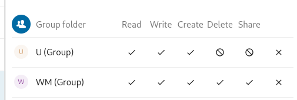

# Nextcloud Groupfolder's ACL flattener

Tl;DR:
- Currently, there is no way for a Groupfolder administrator to know what permissions are applied for a given group or user based on the WebUI  (when parent rules aren't all explicitely set)
- This two-part script will add explicit permissions to "flatten" the permissions and allow for a better understanding

> [!WARNING]
> The script reduces the flexibility of inheritence by adding intermediate rules (updating grandparent won't update grandchild if parent has been altered)

## Why this script

Before Groupfolder 15.3.6 ( or 14.0.9, 16.0.5 ), all inherited permissions were shown as `✔`, implying that the permission was set as true, even when it was not.

|GroupFolders interface|Web UI|OCC Cli|
|--|--|--|
||||

> Delete and Share were denied manually for U (Group), but if "write" was unchecked from the Groupfolders interface, a check would still be displayed

Currently ( >= GF 14.0.9 / 15.3.6 / 16.0.5), the end user will see greyed dashes no matter what the Groupfolder ACLs are.
**This rule applies to every child<-> parent relationship.**

|GroupFolders interface|Web UI|OCC Cli|
|--|--|--|
||||

How the subdirectory WebUI appears:


**At this point and by looking at the web ui, the Groupfolder manager is unable to know what permissions the `U (Group)` has on the Directory nor the subdirectory.**


By using the script, the end result will shows the real permissions by adding them at every needed place.

|GroupFolders interface|Web UI|OCC Cli|
|--|--|--|
||||

How the subdirectory WebUI appears:

The subdirectory is now displaying the right permissions even though the script has only altered its parent's permissions.

## How to use

### Configuration

Update the `migrator-config.php` to update your Nextcloud bin dir and disable the "Dry Run" mode.

### Run

> [!IMPORTANT]
> Before running the script, make sure you have made a backup your database, as changes will be hard to revert manually.

Optional: It's always nice to have an export of the ACLs to see the changes.
```
occ groupfolders:list
```
and
```
occ groupfolders:permissions [ID]
```


First, run the "Fill" script.
```
php ./GroupFolderACL_Fill.php
```
**This script will:**
- Scan for all rules of all groupfolders
- Find partial rules
- Fill the "blanks" to explicitely set the inherited permissions.

eg:
```
Completed rules for group/Management on __groupfolders/1/A before: [-delete, -share], after: [+read, +write, +create, -delete, -share]
```

Once done, run the "RemoveDuplicate" script.
```
php ./GroupFolderACL_RemoveDuplicate.php
```
**This script will:**
- Scan for all rules of all groupfolders
- Find all rules that are similar to their parents
- Remove them so the regular inheritance system can take place and reduce the maintenance labor

eg:
```
Duplicate found for group/U between __groupfolders/1/B and __groupfolders/1
```
## Full Example
```
==========  Nextcloud occ groupfolders:permissions 46  ==========

+------+--------------------+-----------------------------------------+
| Path | User/Group         | Permissions                             |
+------+--------------------+-----------------------------------------+
| /    | group: U           | -write, -create, -delete, -share        |
|      | group: WM          |                                         |
| A    | group: Management  | -delete, -share                         |
|      | group: U           | +read, +write, +create, +delete, +share |
|      | group: WM          | +read, +write, +create, +delete, +share |
| A/A2 | group: Management  | +read, +write, +create, -delete, +share |
|      | group: U           | +read, +write, +create, +delete, +share |
|      | group: WM          | +read, +write, +create, +delete, +share |
| B    | group: Management  | -share                                  |
|      | group: U           | -read, -write, -create, -delete, -share |
|      | group: WM          | +read, +write, +create, +delete, +share |
|      | user: maurice.moss | -write, -create, -delete                |
| B/B2 | group: Management  | +read, -write, +create, +delete, +share |
|      | group: U           | -read, -write, -create, -delete, -share |
|      | group: WM          | +read, +write, +create, +delete, -share |
|      | user: maurice.moss | +read, -write, -create, -delete, +share |
+------+--------------------+-----------------------------------------+
```
Running GroupFolderACL_Fill.php
```
sudo php ./GroupFolderACL_Fill.php
Completed rules for group/WM on __groupfolders/46 before: [], after: [+read, +write, +create, +delete, +share]
Completed rules for group/U on __groupfolders/46 before: [-write, -create, -delete, -share], after: [+read, -write, -create, -delete, -share]
Completed rules for group/Management on __groupfolders/46/A before: [-delete, -share], after: [+read, +write, +create, -delete, -share]
Completed rules for group/Management on __groupfolders/46/B before: [-share], after: [+read, +write, +create, +delete, -share]
Completed rules for user/maurice.moss on __groupfolders/46/B before: [-write, -create, -delete], after: [+read, -write, -create, -delete, +share]
5 rules has been updated to include implicit permissions.
END
```
Running GroupFolderACL_RemoveDuplicate.php
```
sudo php ./GroupFolderACL_RemoveDuplicate.php
Duplicate found for group/WM  between paths __groupfolders/46/A and __groupfolders/46
Duplicate found for group/U  between paths __groupfolders/46/A/A2 and __groupfolders/46/A
Duplicate found for group/WM  between paths __groupfolders/46/A/A2 and __groupfolders/46/A
Duplicate found for group/WM  between paths __groupfolders/46/B and __groupfolders/46
Duplicate found for group/U  between paths __groupfolders/46/B/B2 and __groupfolders/46/B
Duplicate found for user/maurice.moss  between paths __groupfolders/46/B/B2 and __groupfolders/46/B
6 duplicated acl rules has been deleted
END
```
End result
```
==========  Nextcloud occ groupfolders:permissions 46  ==========

+------+--------------------+-----------------------------------------+
| Path | User/Group         | Permissions                             |
+------+--------------------+-----------------------------------------+
| /    | group: U           | +read, -write, -create, -delete, -share |
|      | group: WM          | +read, +write, +create, +delete, +share |
| A    | group: Management  | +read, +write, +create, -delete, -share |
|      | group: U           | +read, +write, +create, +delete, +share |
| A/A2 | group: Management  | +read, +write, +create, -delete, +share |
| B    | group: Management  | +read, +write, +create, +delete, -share |
|      | group: U           | -read, -write, -create, -delete, -share |
|      | user: maurice.moss | +read, -write, -create, -delete, +share |
| B/B2 | group: Management  | +read, -write, +create, +delete, +share |
|      | group: WM          | +read, +write, +create, +delete, -share |
+------+--------------------+-----------------------------------------+
```

## Credits
These two php scripts were developped by [M. Coupin](https://github.com/tcoupin) in collaboration with Arawa. They have been used to "fix" the Nextcloud instance he's managing with success.
